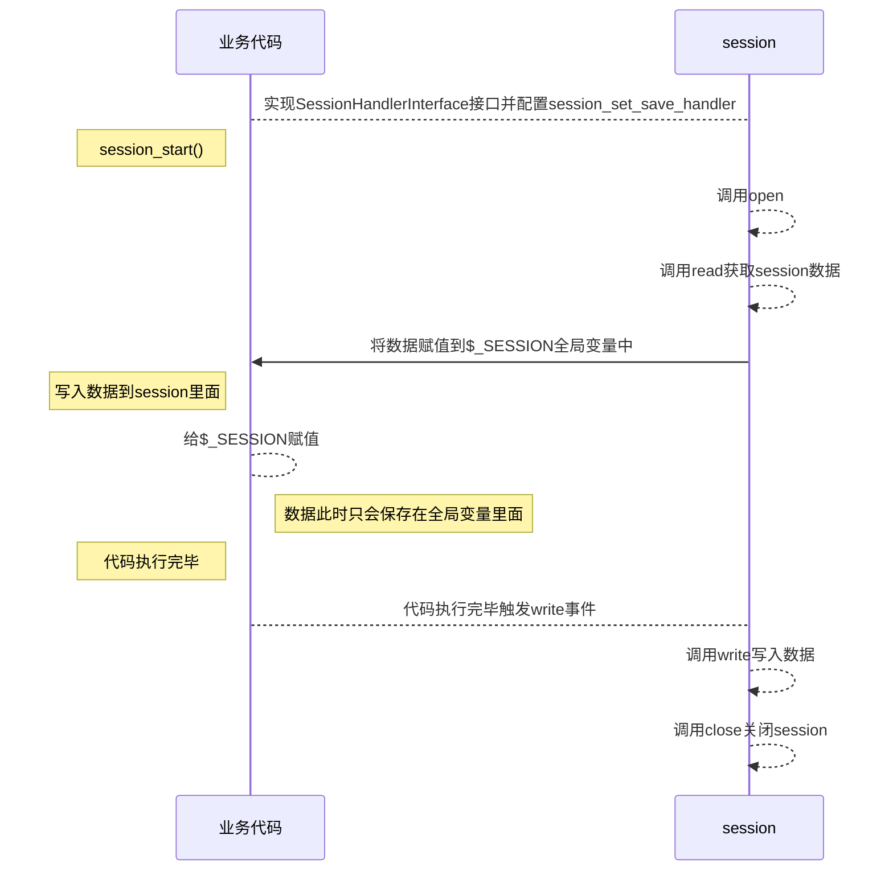

session是用来在服务端保存用户会话的，通常是用户登录成功之后，记录用户的会话信息，比如用户的ID和用户的openid等数据。然后用户在下次进行访问的时候，通过session_id就知道本次访问的用户对应的信息是什么。

php默认有session保存的机制，但是session保存是使用文件缓存的，我们不希望使用这种方式的话，我们就需要对session的保存方式进行重写。需要使用到PHP给我们提供的一些功能。下面就是介绍这个功能怎么使用的一个文档。


## 问与答

- session是什么时候被开启的

当PHP-fpm在处理请求的时候就会判断是否需要自动开启session。这是在php.ini文件决定的。但是如果设置的是不自动开启，那就需要在代码里面决定什么时候开启session。

- 每条请求都需要维护session吗？

就只有开启了session才需要维护session。如果我们要手动开启session的话需要执行session_start()函数

- session数据是保存在哪里的

在PHP的配置文件里面有一个默认的保存路劲,我们可以配置一个自己定义的保存路劲。默认都是以文件格式进行保存的。且保存的数据都是被序列化保存进去的，PHP会自动保存，我们不用太关心里面的内容长什么样。因为你也看不懂。

- 如果我们不想session保存在文件里面，我们想保存在Redis里面应该怎么做

这个问题就是我们今天要讨论的主要内容了。在下面会详细回答。这里贴一个[参考文档](https://www.php.net/manual/zh/function.session-set-save-handler.php)


## 自定义session保存方式

### 应用场景和问题解析

我们通常有这样的需求，就是我们线上的服务器是做了负载均衡的，用户的请求是平均分配到每一台处理服务器上面去。在这种模式的情况下，就有可能出现，用户的请求可能一会是A服务器处理的，一会是B服务器处理的。如果在这种模式下我们还采用PHP自带的session的话，就会出现一个问题就是用户的信息记录在了A服务器的session里面。但是请求被分发到B服务器上面去的时候却没有这个用户的信息。(负载均衡的模式有很多种，也可以避免这种问题，但是这不是我们今天讨论的要点)。遇到这种情况，我们有几种解决方案。

第一种就是，不使用session了。就没有这种困惑了。

第二种是，把session保存到统一一个地方去，就比如我们的Redis里面。选择Redis的原因，也是因为他是内存级别的，他的速度很快，而且很适用于我们session这种场景。


### 实现方案

其实PHP给我们提供了一个函数`session_set_save_handler`，这个函数是让我们写我们的session处理器，我们自己决定要怎么处理session的保存和读取还有过期时间等。然后PHP会来调用我们的这些处理器方法。

它的流程是这样的。

1. 新建一个类实现`SessionHandlerInterface`接口。这个接口是里面有几个方法。将里面的几个方法实现了。然后等着PHP来调用就可以了。主要有一下几个

> ```php
> open(string $savePath, string $sessionName)
> ```
>
> open 回调函数类似于类的构造函数， 在会话打开的时候会被调用。 这是自动开始会话或者通过调用 [session_start()](https://www.php.net/manual/zh/function.session-start.php) 手动开始会话 之后第一个被调用的回调函数。 此回调函数操作成功返回 **`TRUE`**，反之返回 **`FALSE`**。
>
> ```php
> close()
> ```
>
> close 回调函数类似于类的析构函数。 在 write 回调函数调用之后调用。 当调用 [session_write_close()](https://www.php.net/manual/zh/function.session-write-close.php) 函数之后，也会调用 close 回调函数。 此回调函数操作成功返回 **`TRUE`**，反之返回 **`FALSE`**。
>
> **这里请看write**
>
> ```
> read(string $sessionId)
> ```
>
> 如果会话中有数据，read 回调函数必须返回将会话数据编码（序列化）后的字符串。 如果会话中没有数据，read 回调函数返回空字符串。
>
> 在自动开始会话或者通过调用 [session_start()](https://www.php.net/manual/zh/function.session-start.php) 函数手动开始会话之后，PHP 内部调用 read 回调函数来获取会话数据。 在调用 read 之前，PHP 会调用 open 回调函数。
>
> read 回调返回的序列化之后的字符串格式必须与 `write` 回调函数保存数据时的格式完全一致。 PHP 会自动反序列化返回的字符串并填充 [$_SESSION](https://www.php.net/manual/zh/reserved.variables.session.php) 超级全局变量。 虽然数据看起来和 [serialize()](https://www.php.net/manual/zh/function.serialize.php) 函数很相似， 但是需要提醒的是，它们是不同的。 请参考： [session.serialize_handler](https://www.php.net/manual/zh/session.configuration.php#ini.session.serialize-handler)。
>
> ```
> write(string $sessionId, string $data)
> ```
>
> 在会话保存数据时会调用 `write` 回调函数。 此回调函数接收当前会话 ID 以及 [$_SESSION](https://www.php.net/manual/zh/reserved.variables.session.php) 中数据序列化之后的字符串作为参数。 序列化会话数据的过程由 PHP 根据 [session.serialize_handler](https://www.php.net/manual/zh/session.configuration.php#ini.session.serialize-handler) 设定值来完成。
>
> 序列化后的数据将和会话 ID 关联在一起进行保存。 当调用 `read` 回调函数获取数据时，所返回的数据必须要和 传入 `write` 回调函数的数据完全保持一致。
>
> PHP 会在脚本执行完毕或调用 [session_write_close()](https://www.php.net/manual/zh/function.session-write-close.php) 函数之后调用此回调函数。 注意，在调用完此回调函数之后，PHP 内部会调用 `close` 回调函数。
>
> > **Note**:
> >
> > PHP 会在输出流写入完毕并且关闭之后 才调用 write 回调函数， 所以在 write 回调函数中的调试信息不会输出到浏览器中。 如果需要在 write 回调函数中使用调试输出， 建议将调试输出写入到文件。
>
> ```
> destroy($sessionId)
> ```
>
> 当调用 [session_destroy()](https://www.php.net/manual/zh/function.session-destroy.php) 函数， 或者调用 [session_regenerate_id()](https://www.php.net/manual/zh/function.session-regenerate-id.php) 函数并且设置 destroy 参数为 **`TRUE`** 时， 会调用此回调函数。此回调函数操作成功返回 **`TRUE`**，反之返回 **`FALSE`**。
>
> ```
> gc($lifetime)
> ```
>
> 为了清理会话中的旧数据，PHP 会不时的调用垃圾收集回调函数。 调用周期由 [session.gc_probability](https://www.php.net/manual/zh/session.configuration.php#ini.session.gc-probability) 和 [session.gc_divisor](https://www.php.net/manual/zh/session.configuration.php#ini.session.gc-divisor) 参数控制。 传入到此回调函数的 lifetime 参数由 [session.gc_maxlifetime](https://www.php.net/manual/zh/session.configuration.php#ini.session.gc-maxlifetime) 设置。 此回调函数操作成功返回 **`TRUE`**，反之返回 **`FALSE`**。
>
> ```
> create_sid()
> ```
>
> 当需要新的会话 ID 时被调用的回调函数。 回调函数被调用时无传入参数， 其返回值应该是一个字符串格式的、有效的会话 ID。




### yii2 Redis Session组件讲解

```php
<?php

namespace yii\redis;

use Yii;
use yii\base\InvalidConfigException;


class Session extends \yii\web\Session
{
    
    public $redis = 'redis';
    
    public $keyPrefix;


    /**
     * 组件初始化
     */
    public function init()
    {
        // 先获取Redis对象
        if (is_string($this->redis)) {
            $this->redis = Yii::$app->get($this->redis);
        } elseif (is_array($this->redis)) {
            if (!isset($this->redis['class'])) {
                $this->redis['class'] = Connection::className();
            }
            $this->redis = Yii::createObject($this->redis);
        }
        if (!$this->redis instanceof Connection) {
            throw new InvalidConfigException("Session::redis must be either a Redis connection instance or the application component ID of a Redis connection.");
        }
        // 配置前缀
        if ($this->keyPrefix === null) {
            $this->keyPrefix = substr(md5(Yii::$app->id), 0, 5);
        }
        parent::init();
    }

    /**
     * 表示自定义回话 永远返回true
     */
    public function getUseCustomStorage()
    {
        return true;
    }

    /**
     * 获取session的时候调用
     */
    public function readSession($id)
    {
        $data = $this->redis->executeCommand('GET', [$this->calculateKey($id)]);

        return $data === false || $data === null ? '' : $data;
    }

    /**
     * 写入session的时候调用
     */
    public function writeSession($id, $data)
    {
        return (bool) $this->redis->executeCommand('SET', [$this->calculateKey($id), $data, 'EX', $this->getTimeout()]);
    }

    /**
     * 销毁session的时候调用
     */
    public function destroySession($id)
    {
        $this->redis->executeCommand('DEL', [$this->calculateKey($id)]);
        // @see https://github.com/yiisoft/yii2-redis/issues/82
        return true;
    }

    /**
     * 拼接键名
     */
    protected function calculateKey($id)
    {
        return $this->keyPrefix . md5(json_encode([__CLASS__, $id]));
    }
}

```

其实最主要的是它父级里面的这几个方法

```php
    /**
     * Starts the session.
     */
    public function open()
    {
        // 是否在运行状态了
        if ($this->getIsActive()) {
            return;
        }
        // 注册处理器
        $this->registerSessionHandler();
        // 设置cookie参数
        $this->setCookieParamsInternal();
        // 开启session
        YII_DEBUG ? session_start() : @session_start();

        if ($this->getIsActive()) {
            Yii::info('Session started', __METHOD__);
            $this->updateFlashCounters();
        } else {
            $error = error_get_last();
            $message = isset($error['message']) ? $error['message'] : 'Failed to start session.';
            Yii::error($message, __METHOD__);
        }
    }

    /**
     * Registers session handler.
     * @throws \yii\base\InvalidConfigException
     */
    protected function registerSessionHandler()
    {
        // 如果存在处理器
        if ($this->handler !== null) {
            if (!is_object($this->handler)) {
                $this->handler = Yii::createObject($this->handler);
            }
            if (!$this->handler instanceof \SessionHandlerInterface) {
                throw new InvalidConfigException('"' . get_class($this) . '::handler" must implement the SessionHandlerInterface.');
            }
            YII_DEBUG ? session_set_save_handler($this->handler, false) : @session_set_save_handler($this->handler, false);
        } elseif ($this->getUseCustomStorage()) {   // 是否使用自定义回话
            // 设置处理器
            if (YII_DEBUG) {
                session_set_save_handler(
                    [$this, 'openSession'],
                    [$this, 'closeSession'],
                    [$this, 'readSession'],
                    [$this, 'writeSession'],
                    [$this, 'destroySession'],
                    [$this, 'gcSession']
                );
            } else {
                @session_set_save_handler(
                    [$this, 'openSession'],
                    [$this, 'closeSession'],
                    [$this, 'readSession'],
                    [$this, 'writeSession'],
                    [$this, 'destroySession'],
                    [$this, 'gcSession']
                );
            }
        }
    }
```

代码就是这么简单。原理也是这么简单。可以自己亲自尝试去Redis里面看看有没有保存的数据了

