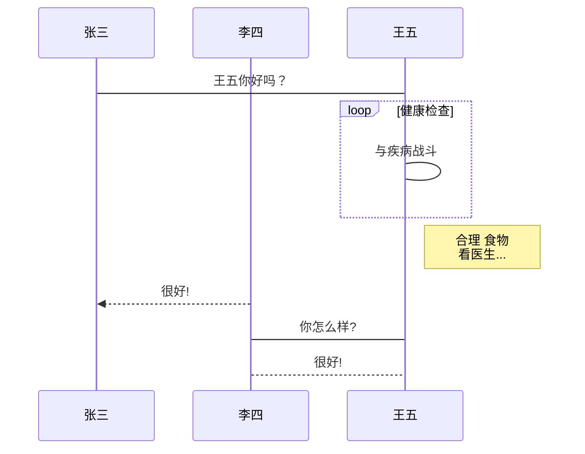

# 简介

> markdown是非常好用的文档编辑工具应该大家都毋庸置疑。我经常使用的是typora这个编辑器来进行编辑。非常好用
>
> 除了普通的编辑文档之外，我们可能还会画一些流程图、UML等。但是我们不可能在其他地方画好了，然后截图，放在markdown文档里面吧。这样效率很低，而且不易修改。
>
> 其实在markdown里面就可以画流程图了。大家只需要输入一些代码就可以画出非常好看的图。


## 如何画图

首先直接给你一个参考链接，你可以去那里学习。我这里只是一个简单的示例

> [runoob流程图教程](https://www.runoob.com/markdown/md-advance.html)

代码如下

```
​```mermaid
%% 时序图例子,-> 直线，-->虚线，->>实线箭头
  sequenceDiagram
    participant 张三
    participant 李四
    张三->王五: 王五你好吗？
    loop 健康检查
        王五->王五: 与疾病战斗
    end
    Note right of 王五: 合理 食物 <br/>看医生...
    李四-->>张三: 很好!
    王五->李四: 你怎么样?
    李四-->王五: 很好!
​```
```

效果如下





## 遇到的问题

虽然我们在typora这样的工具上面可以画流程图，但是我们通常写出来的文档是要放在网页上面的。这就出现一个文档。生成的页面，并不认识这样的代码是需要转化为图片的。所以，你看到的网页可能就是一个很简单的代码格式的一串文字。

所以我们就需要用一些工具来解决这样的问题。那么高级工具就出场了。

>  **Mermaid**


## 如何使用

### jekyll

首先，讲讲我自己的博客是怎么使用的。

声明一下，我不是专业的前端哈。我很多前端的东西都不懂，只能采用一些比较笨的方式来完成。如果你有更加好的方案，请告诉我。

1. 将mermaid下载下来。放到我的博客目录里面去。
2. 然后加上如下配置的代码。就可以展示出来了。

```
<script src="{{ "/js/mermaid.min.js " | prepend: site.baseurl }}"></script>
<script>
var config = {
    startOnLoad:true,
    theme: 'forest',
    flowchart:{
            useMaxWidth:false,
            htmlLabels:true
        }
};
mermaid.initialize(config);
window.mermaid.init(undefined, document.querySelectorAll('.language-mermaid'));
</script>
```


### vuepress

这个就更加简单了。参考如下链接即可完成

> [https://github.com/eFrane/vuepress-plugin-mermaidjs](https://github.com/eFrane/vuepress-plugin-mermaidjs)


1. 添加插件

```
# 添加插件
yarn add -D vuepress-plugin-mermaidjs
```

2. 应用插件

修改`.vuepress/config.js`文件

```js
module.exports = {
    // ...
    plugins: [
        'vuepress-plugin-mermaidjs'
    ]
    // ...
}
```


## 参考链接

- [https://mermaid-js.github.io/mermaid/#/](https://mermaid-js.github.io/mermaid/#/)
- [https://stackoverflow.com/questions/53883747/how-to-make-github-pages-markdown-support-mermaid-diagram](https://stackoverflow.com/questions/53883747/how-to-make-github-pages-markdown-support-mermaid-diagram)
- [https://github.com/eFrane/vuepress-plugin-mermaidjs](https://github.com/eFrane/vuepress-plugin-mermaidjs)
- [https://www.runoob.com/markdown/md-advance.html](https://www.runoob.com/markdown/md-advance.html)

