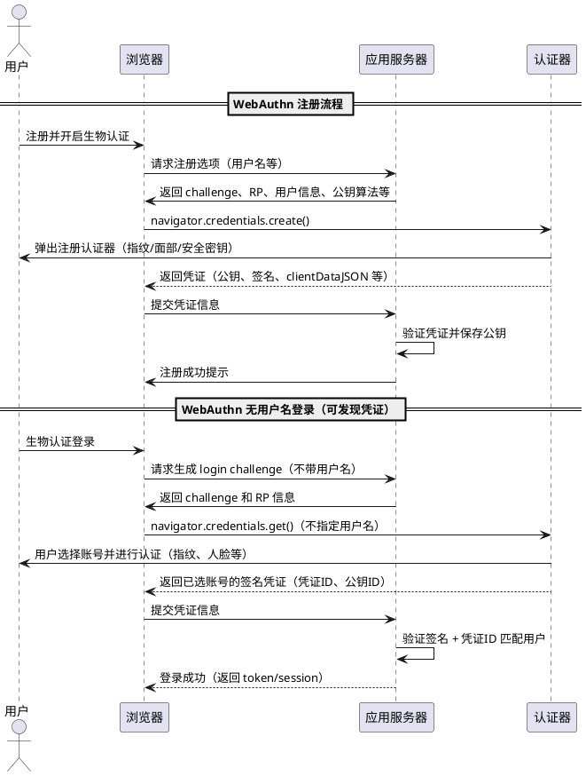

现在登录的网站越来越多，每个网站都需要账户密码。

我又不喜欢把每个网站的密码都设置成一样的。

我又不喜欢记住密码。

能不能不用密码直接登录啊？

例如直接扫脸，或者指纹识别就好了。

当然可以，这就是WebAuthn认证。

直接上流程图

## 体验地址

由Claude生成。[点击链接体验](/html/webauthn_demo.html)

## 其他内容

其实主要的就是两个内容，

1. 调用浏览器创建秘钥(navigator.credentials.create)

2. 调用浏览器获取用户秘钥(navigator.credentials.get)

参数不同，呈现的效果也不一样。具体可以[参考这里](https://developer.mozilla.org/en-US/docs/Web/API/Web_Authentication_API)

## 参考地址

- [https://developer.mozilla.org/en-US/docs/Web/API/Web_Authentication_API](https://developer.mozilla.org/en-US/docs/Web/API/Web_Authentication_API)

